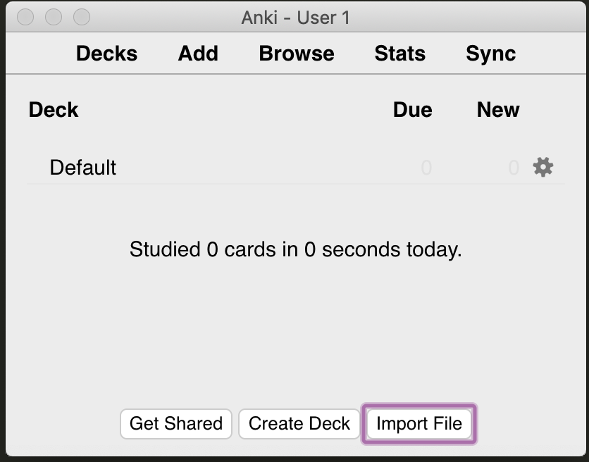
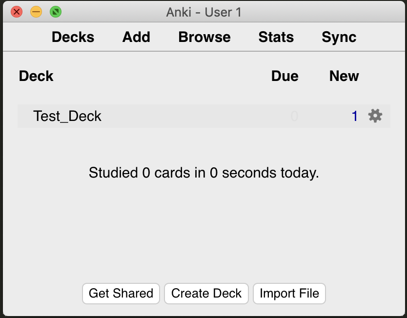
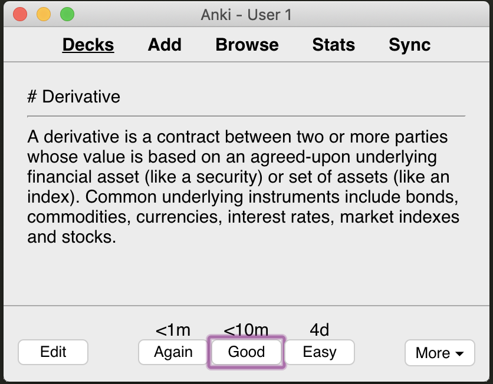

# notes2cards - version 0.1
A simple note taking application that can be transform notes to an Anki deck!

# How To Currently Use

1. Take nows with very simple Markdown only using big headers follwed by the note.
```
# Question
Answer is detailed here.
```
2. Run notes2cards.py with arguments.
```
python3.6 ../notes2cards.py --inputFile test_file.md \
			  --deckName Test_Deck --outputFile test_deck.apkg
```

3. Import your newly created deck into Anki.




## ToDo
1. parser - simple question + answer
2. markdown tool - note taking with tufte style
3. anki and genanki dependencies handled different
4. proper project structure
5. tests
6. add other stuff as it comes up